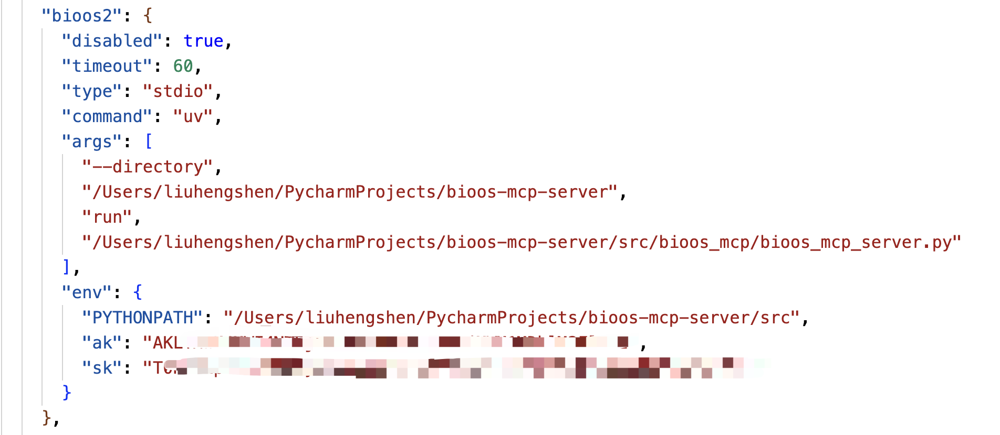
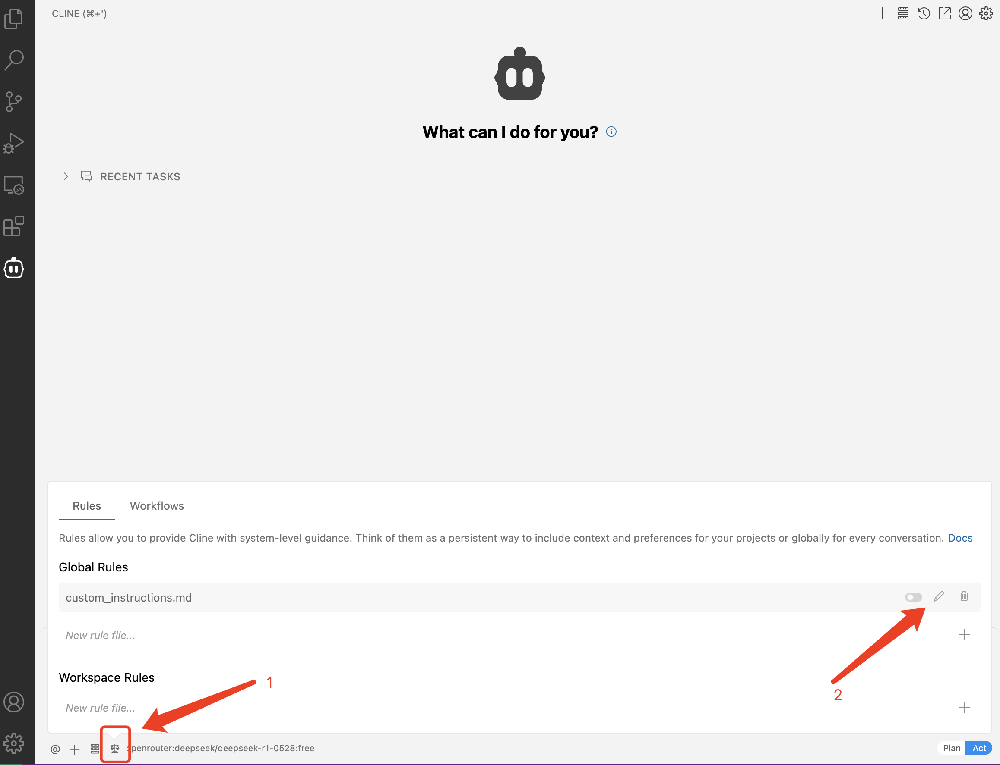
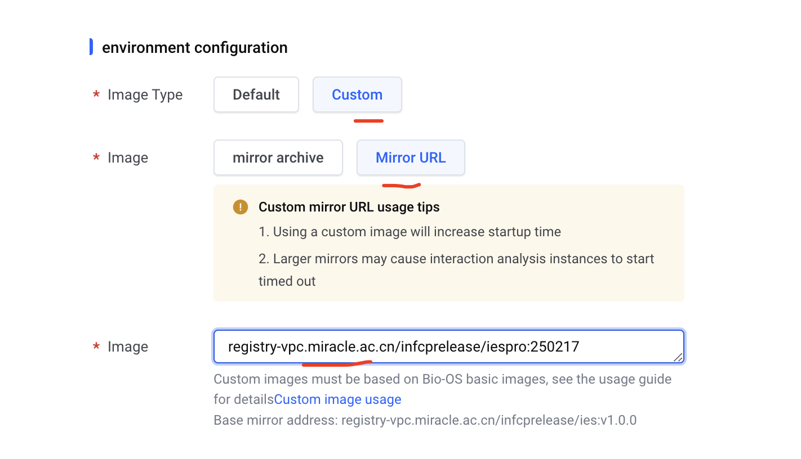
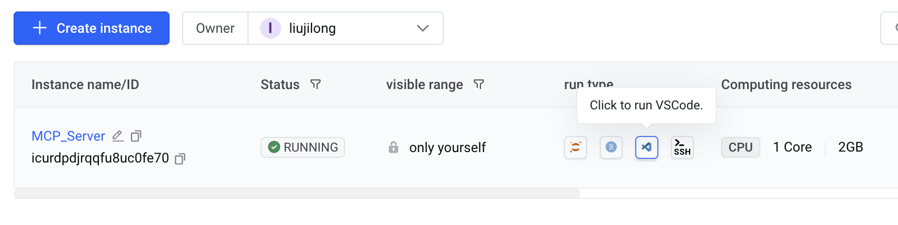
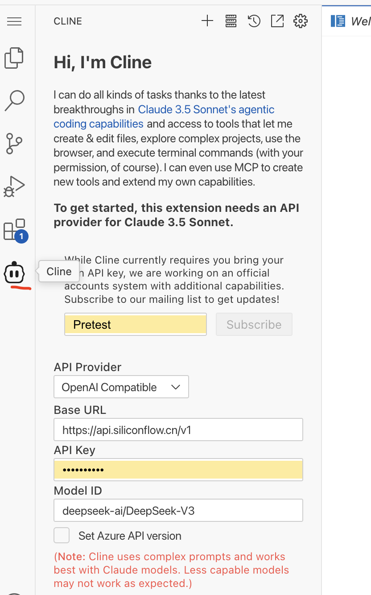
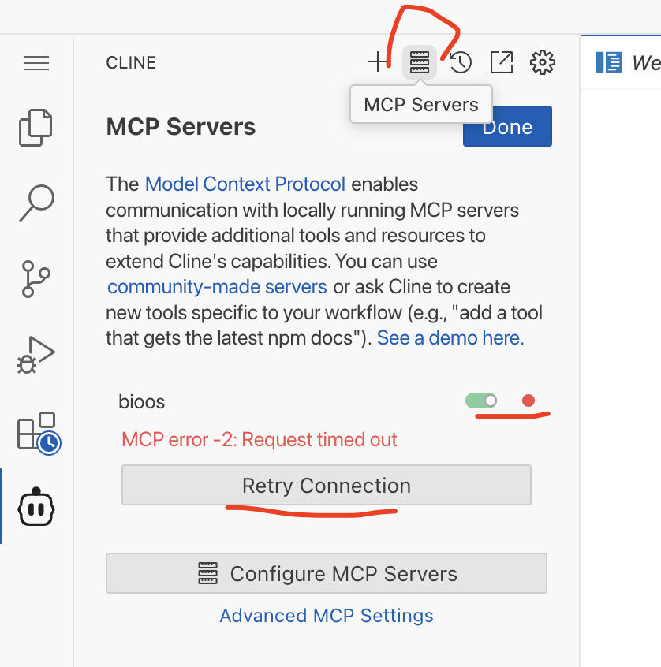
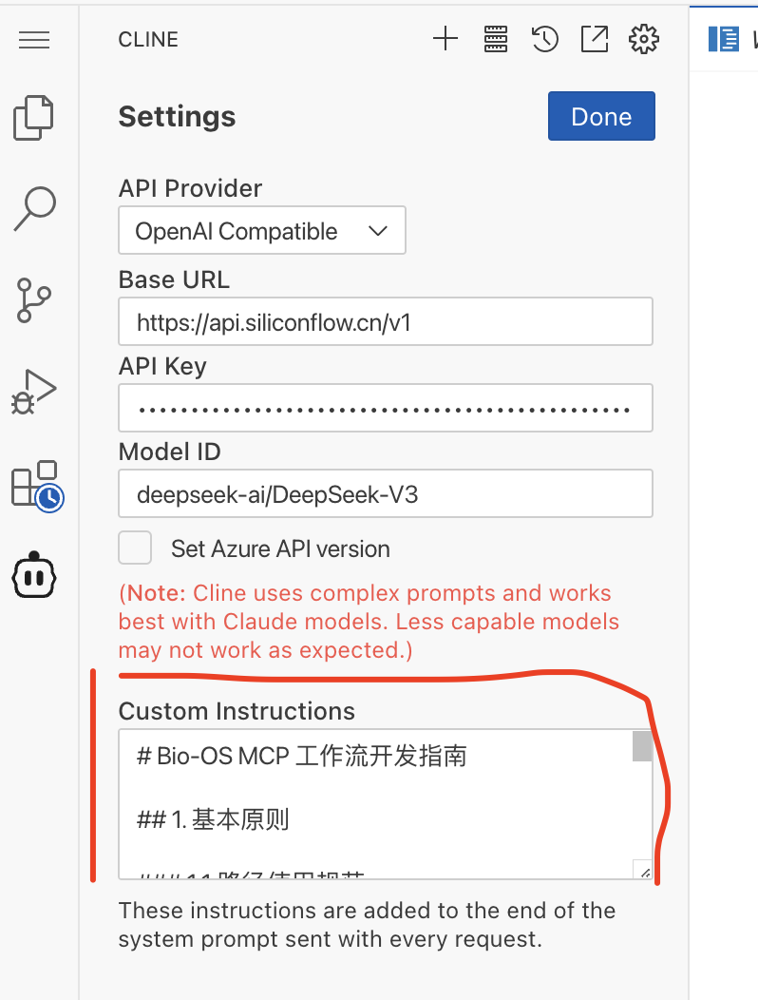

# Bio-OS MCP Server

A Model Context Protocol (MCP) based tool and prompt server for Bio-OS that provides workflow management and Docker image building capabilities.

## Usage
We recommend using the CLINE extension for VSCode to interact with this MCP tool. There are two deployment options available: standalone installation on your local machine or using Code Server in a Miracle Cloud IES instance. Choose the option that best suits your needs.

### Local Installation (Using MCP through local VSCode)
#### Prerequisites
Bio-OS MCP Server requires the following dependencies:

1. Install uv (Python package manager):
```bash
pip install uv
```

2. Install Cromwell (Workflow execution engine):
```bash
brew install cromwell
```

#### Installation
Clone the Bio-OS MCP Server repository:
```bash
git clone https://github.com/GBA-BI/bioos-mcp-server.git
```

#### Configuration
Configure the Bio-OS MCP Server script path in CLINE's MCP settings. Replace the placeholders with absolute paths to your installation:
```json
{
  "mcpServers": {
    "bioos": {
      "command": "path/to/uv",
      "args": [
        "--directory",
        "path/to/bioos-mcp-server",
        "run",
        "path/to/bioos-mcp-server/src/bioos_mcp/bioos_mcp_server.py"
      ],
      "env": {
        "PYTHONPATH": "path/to/bioos-mcp-server/src"
      }
    }
    "dockstore": {
      "command": "path/to/uv",
      "args": [
        "--directory",
        "path/to/bioos-mcp-server",
        "run",
        "path/to/bioos-mcp-server/src/bioos_mcp/dockstore_mcp_server.py"
      ],
      "env": {
        "PYTHONPATH": "path/to/bioos-mcp-server/src"
      }
    }
  }
} 
```

Follow the configuration process shown below. The Bio-OS MCP Server is ready to use when the status turns green. If the connection is unstable, click "Retry Connection":


Since CLINE does not yet support MCP Prompts, copy the contents of `bioos-mcp-prompt.md` into CLINE's Custom Instructions for optimal experience:


After completing the configuration, you can begin using the Bio-OS MCP Server for development.

### Cloud Installation (Using MCP through Code Server in Miracle Cloud)
For Miracle Cloud users, we provide a pre-configured Docker image with all Bio-OS MCP Server dependencies. Follow these steps:

1. Launch an IES instance using the image: `registry-vpc.miracle.ac.cn/infcprelease/iespro:250217`
2. Select "Open with VSCode" to access the development environment:



#### Configuration in Code Server
1. Click the CLINE icon in the left sidebar and configure your LLM model credentials:


2. Navigate to CLINE's MCP configuration page and verify that Bio-OS MCP Server is properly connected. Use "Retry Connection" if needed:


3. Since CLINE does not yet support MCP Prompts, copy the contents of `bioos-mcp-prompt.md` into CLINE's Custom Instructions for optimal experience:


Once configured, you can begin development with Bio-OS MCP Server.

## Features

### 1. Workflow Management
- Submit and monitor workflows
- Upload WDL workflows
- Validate WDL scripts
- Generate input file templates

### 2. Docker Image Management
- Build Docker images
- Check build status
- Monitor build progress
- Retrieve build logs

## API Reference

### Tools
#### bioos server tools
1. `submit_workflow`
   - Function: Submit Bio-OS workflow
   - Parameters:
     - ak: Access Key
     - sk: Secret Key
     - workspace_name: Workspace name
     - workflow_name: Workflow name
     - input_json: Input JSON file path


2. `import_workflow`
   - Function: Upload WDL workflow to Bio-OS system
   - Parameters:
     - ak: Access Key
     - sk: Secret Key
     - workspace_name: Workspace name
     - workflow_name: Workflow name
     - workflow_source: WDL file path
     - workflow_desc: Workflow description

3. `validate_wdl`
   - Function: Validate WDL workflow script
   - Parameters:
     - wdl_path: WDL file path

4. `generate_inputs`
   - Function: Generate WDL input file template
   - Parameters:
     - wdl_path: WDL file path

5. `build_docker_image`
   - Function: Build Docker image
   - Parameters:
     - registry: Image registry address
     - namespace_name: Namespace
     - repo_name: Repository name
     - tag: Version tag
     - source_path: Dockerfile or archive path

6. `check_build_status`
   - Function: Check Docker image build status
   - Parameters:
     - task_id: Build task ID

#### dockstore server tools:
1. dockstore_search
   - Searches Dockstore workflows
   - Supports complex field searches and file retrieval
   - Parameters:
      - query: List of search conditions (searchTerm, field, operator)
      - query_type: "match_phrase" (default) or "wildcard"
      - sentence: Boolean for flexible word order matching
      - output_full: Boolean for full result display
      - get_files: Optional workflow path to retrieve files

2. result_summary
   - Generates search result summaries
   - Optional parameter: path (specific results file path)
   - Auto-finds latest results file if no path provided

3. dockstore_workflow_download
   - Downloads workflow files
   - Required parameters: json_file, workflow_path


### Prompts (Not supported in Cline yet)

1. `wdl_development_workflow_prompt`
   - Function: Generate complete guidance for WDL workflow development
   - Content:
     - WDL script development steps
     - Task structure guidelines
     - Runtime configuration requirements
     - Docker image preparation guide

2. `wdl_runtime_prompt`
   - Function: Generate WDL runtime configuration template
   - Content:
     - Required docker image configuration
     - Memory settings (default: 8 GB)
     - Disk settings (default: 20 GB)
     - CPU settings (default: 4)

3. `workflow_input_prompt`
   - Function: Generate workflow input preparation guide
   - Content:
     - Input file preparation steps
     - Parameter validation guidelines
     - File path requirements

4. `workflow_submission_prompt`
   - Function: Generate workflow submission template
   - Content:
     - Required credentials (ak/sk)
     - Workspace configuration
     - Input file requirements

5. `docker_build_prompt`
   - Function: Generate Docker build process guide
   - Content:
     - Dockerfile generation steps
     - Build configuration requirements
     - Image registry settings
     - Build status monitoring guide

Note: Prompts are currently not supported in Cline environment. These prompts are only available when using the MCP server directly or through Claude Desktop.


## Contributing

Issues and Pull Requests are welcome.

## License

MIT License